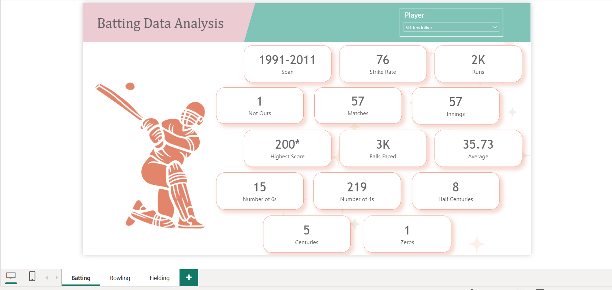
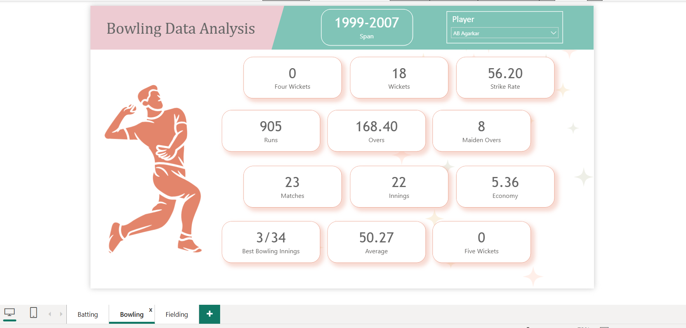
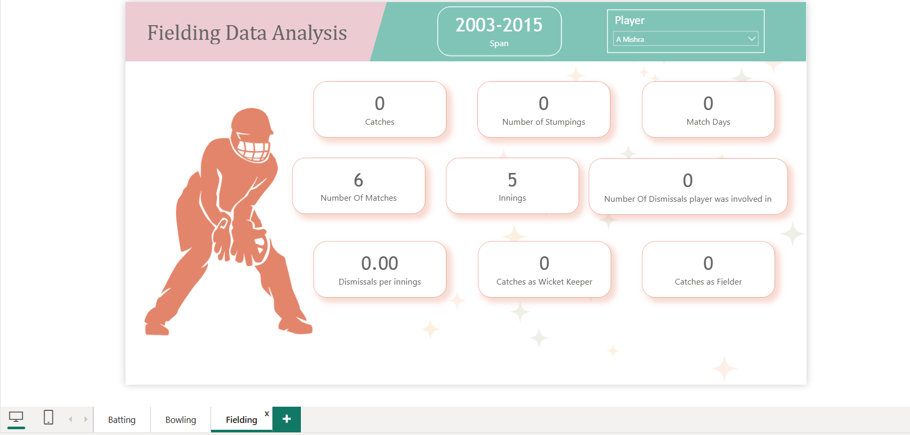

# ESPN Cricket Data Analysis

## 📊 Project Overview

**ESPN Cricket Data Analysis** is a Power BI dashboard created to practice data cleaning, data transformation, and data visualization using ODI cricket statistics sourced from ESPNcricinfo.

The project focuses on analyzing **India vs South Africa ODI performance** across three key areas:

- 🏏 Batting
- 🎯 Bowling
- 🧤 Fielding

---

## 🎯 Objective

The main objective of this project was to practice Power BI by transforming cricket statistics into an interactive and easy-to-understand dashboard.

---

## 📌 Dashboard Pages

### 🏏 1. Batting Analysis

The Batting Analysis page provides an overview of player batting performance, including:

- Runs
- Matches
- Innings
- Batting Average
- Strike Rate
- Highest Score
- Balls Faced
- Number of 4s
- Number of 6s
- Half Centuries
- Centuries
- Not Outs
- Zeros

### 🎯 2. Bowling Analysis

The Bowling Analysis page provides key bowling performance statistics, including:

- Wickets
- Runs
- Overs
- Strike Rate
- Economy Rate
- Bowling Average
- Best Bowling Figures
- Maidens
- 4-Wicket Hauls
- 5-Wicket Hauls
- Matches
- Innings

### 🧤 3. Fielding Analysis

The Fielding Analysis page provides fielding-related statistics, including:

- Catches
- Catches as Wicket Keeper
- Catches as Fielder
- Stumpings
- Dismissals Player Was Involved In
- Dismissals per Innings
- Matches
- Innings

---

## 🧹 Data Preparation

The cricket data was collected from **ESPNcricinfo Statsguru** and prepared for analysis in Power BI.

The data preparation process included:

- Changing data types
- Merging data
- Appending datasets
- Replacing values
- Cleaning and preparing the data for visualization

---

## 📊 Dashboard Interactivity

The dashboard includes **Player slicers** that allow users to select individual players and view their corresponding:

- Batting statistics
- Bowling statistics
- Fielding statistics

---

## 🛠️ Tools & Technologies

- **Power BI**
- **Power Query**
- **Data Cleaning**
- **Data Transformation**
- **Data Visualization**

---

## 📷 Dashboard Preview

### Batting Dashboard

### Bowling Dashboard

### Fielding Dashboard

---

## 📁 Repository Contents

| File | Description |
|------|-------------|
| `espn_pr.pbit` | Power BI template file |
| `Batting.png` | Batting dashboard screenshot |
| `Bowling.png` | Bowling dashboard screenshot |
| `Fielding.png` | Fielding dashboard screenshot |
| `README.md` | Project documentation |

---

## 💡 Key Learning

This project provided hands-on experience with:

- Cleaning raw data using Power Query
- Transforming and preparing datasets
- Combining data using merge and append operations
- Building interactive Power BI dashboards
- Presenting cricket statistics through visualizations

---

## 🚀 Future Improvements

Possible improvements for this project include:

- Adding more advanced DAX calculations
- Adding additional cricket teams and players
- Creating more detailed performance comparisons
- Adding trend analysis across different years
- Adding more interactive Power BI features

---

## 👤 Author

**Sai Vamsi Kambala**

This project was created as part of my hands-on practice in **Power BI and Data Analytics**.
